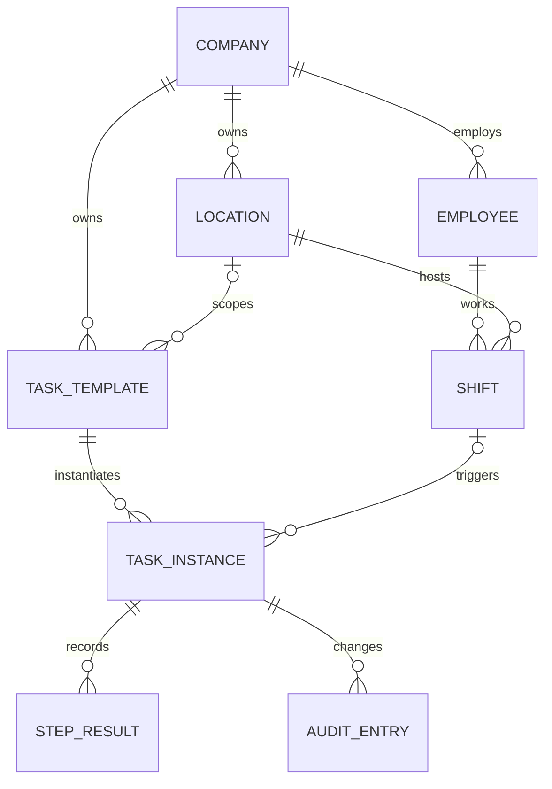

# Domänenmodell

Status: konzeptionelles Modell. Namen und Invarianten sind Orientierung für API und Datenbankschema; sie sind noch keine implementierten Tabellen.

## Identität, Zugehörigkeit und Standort

`Company` bezeichnet im ersten Slice eindeutig die Daten- und Berechtigungsgrenze eines Mandanten. Ihre ID wird nicht aus Rechtsform, Firmenname oder Installation abgeleitet. Rechtsträger und Konzernbeziehungen müssen später ausdrücklich zugeordnet werden; sie sind nicht automatisch dieselbe Identität. `Location` ist ein fachlicher Standort innerhalb genau einer Company. Die technische Serveridentität `nodeId` und die aktive Schreibzuständigkeit sind davon getrennt: Ein Serverwechsel ändert keine Location-ID. Zunächst wird je Standort ein Server betrieben, ohne daraus einen gemeinsamen Primärschlüssel zu machen. Die Vision sieht die spätere Hierarchie `Company → Region → Location → Department → Area → Workstation` vor. Der erste Slice benötigt nur Company und Location. Weitere Stufen folgen erst einem konkreten Anwendungsfall.

`Account` bezeichnet eine Anmeldeidentität. `Employee` ist ein dauerhaft referenzierbares operatives Mitarbeiterprofil innerhalb einer Company, weder das Login noch bereits ein Arbeitsvertrag oder ein mandantenübergreifender Personendatensatz. Nicht jeder Account ist ein Mitarbeiter; ein Profil kann vor der ersten Anmeldung existieren. Vertrags- und Beschäftigungszeiträume werden beim HR-Ausbau eigene, zeitlich gültige Referenzen. Wiedereintritt, Vertragswechsel oder neue Personalnummer dürfen historische Schichten nicht einer anderen Identität zuordnen. Profile verschiedener Companies werden nicht automatisch zusammengeführt.

Die Plattformkomponente für Identität und Berechtigungen besitzt die explizite, mandantengebundene Account-Employee-Verknüpfung und die Rollenzuordnungen. Im ersten Slice schreibt sie ausschließlich der lokale Standortserver. Verknüpfen, Ändern und Entziehen sind berechtigte, auditierte Vorgänge; `people` bestätigt über einen Port das referenzierte Profil. Eine fachliche Standortzuordnung allein erteilt keinen Login oder Zugriff. Sensible HR-Akten bleiben getrennt von dem minimalen Employee-Modell und seinen operativen API-Sichten.

Alle fachlichen Datensätze erhalten stabile, standortübergreifend eindeutige IDs, Mandantenbezug, Entstehungszeit und dokumentierte Änderungsversion. Zeiten werden als Zeitpunkte mit Offset beziehungsweise UTC gespeichert; der Standort besitzt eine IANA-Zeitzone für Anzeige und wiederkehrende Regeln. Eine Schicht über Mitternacht oder eine Zeitumstellung darf dadurch nicht implizit verkürzt werden.

IDs bleiben bei Umbenennung, Serverwechsel und Export/Import erhalten und werden nach Löschung nicht neu vergeben. Fachliche Kennungen wie Personalnummern sind separate Attribute. Eine Übertragung zwischen Companies ist eine explizite Daten- und Berechtigungsmigration, keine gewöhnliche Änderung von `companyId`.

## Fachobjekte des ersten Slice

| Modell | Eigentümer | Kernaussage und Invarianten |
| --- | --- | --- |
| `Company` | `organization` | Eindeutige Mandantengrenze. Kein Objekt darf unbemerkt in eine andere Company wechseln. |
| `Location` | `organization` | Gehört zu genau einer Company und besitzt Zeitzone und Betriebsstatus. Standortgebundene Daten referenzieren diese ID. |
| `Employee` | `people` | Gehört zu einer Company; Standortzuordnung ist explizit und zeitlich gültig. Personaldaten sind feiner berechtigt als Aufgaben- und Dienstplandaten. |
| `Shift` | `workforce` | Gehört zu einem Employee und einer Location; Beginn liegt vor Ende. Veröffentlichung und spätere Änderung sind nachvollziehbare Vorgänge. Geplante Zeit ist von tatsächlicher Arbeitszeit getrennt. |
| `TaskTemplate` | `tasks` | Wiederverwendbare, versionierte Definition mit Geltungsbereich, Zeitregel und geführten Schritten. Nur freigegebene Versionen erzeugen Instanzen. |
| `TaskInstance` | `tasks` | Konkrete Arbeit an genau einer Location, mit Referenz und Snapshot der geltenden Vorlagenversion. Erzeugung aus Shift/Vorlage/Termin ist idempotent. |
| `TaskExecution` / `StepResult` | `tasks` | Dokumentiert Beginn, Eingaben, Nachweise, Abschluss und etwaige Ausnahme einer Instanz. Pflichtschritte und Regeln werden serverseitig geprüft. |
| `AuditEntry` | `audit` | Zu einem Befehl korrelierter Nachweis mit Akteur, Zeit, Mandant, Standort, Entität und Änderung. Reguläre Anwendungszugriffe können ihn nicht ändern; Korrektur erfolgt durch neuen Eintrag. |

Der geplante Zustand einer `Shift` ist keine Zeiterfassung. `TaskInstance.assignee` bezeichnet eine explizite Zuordnung, während „für diese Person empfohlen“ eine berechnete Ansicht sein kann. Eine Aufgabe darf bei ungeklärtem Konflikt oder fehlendem Pflichtnachweis nicht als abgeschlossen erscheinen. Fachliche Eingaben und Audit-Eintrag müssen denselben dauerhaften Erfolg oder Fehlschlag haben. Löschen oder Änderung einer Vorlage verändert begonnene oder erledigte Instanzen nicht rückwirkend.

`TaskExecution` und `StepResult` sind im ersten Slice untergeordnete Daten der `TaskInstance`, keine unabhängigen Aggregate mit eigenem Abschlussstatus. Schrittänderung, Pflichtprüfung und Abschluss verwenden dieselbe Konsistenz- und Versionsgrenze. Versionsprüfung und Schreiben geschehen atomar; eine Prüfung vor der Transaktion verhindert keine konkurrierenden Abschlüsse. Datenbank-Constraints sichern Eindeutigkeit und Referenzen einschließlich Company-/Location-Zugehörigkeit zusätzlich zur Application-Prüfung.

## Beziehungen und Zustände

Eine Vorlage kann auch unternehmensweit gelten; dann bezeichnet `Location` in der Skizze den Geltungsbereich einer konkreten Freigabe oder Zuordnung. Das Modell bindet nicht jede Aufgabe an genau eine Schicht: Ereignisse und manuelle Auslösung sind spätere Entstehungsarten.

Für `Shift` ist `draft → published → cancelled` vorgesehen. Änderungen oder Stornierungen nach Veröffentlichung benötigen vor ihrer Freigabe eine Regel für bereits erzeugte und laufende Aufgaben; bis dahin bleiben diese Aktionen gesperrt. Eine unterstützte Änderung erzeugt eine neue Revision und eine sichtbare Benachrichtigung. Für `TaskInstance` sind `open → in_progress → completed` sowie `blocked` und `cancelled` nötig. Aus `blocked` ist nach dokumentierter Klärung eine berechtigte Wiederaufnahme oder begründete Stornierung möglich; die ursprünglichen Eingaben und Abweichungen bleiben erhalten. Die Wiederaufnahme ersetzt keine erneute Pflichtprüfung. `completed` und `cancelled` sind terminal; eine Korrektur ist ein eigener, auditierter Vorgang. Jeder Zustandswechsel prüft erwartete Version, Berechtigung und Standortkontext. Die endgültigen Zustandsnamen werden im API-Vertrag festgelegt.

## Später anschließende Domänen

`EmployeeSkill` und Nachweise gehören zum Personal- und Lernkontext; die Aufgabenplanung konsumiert nur freigegebene, für den Zweck nötige Eignungsinformationen. Verfügbarkeit, Abwesenheit und Zeiterfassung sind eigenständige fachliche Konzepte und dürfen nicht aus einer bloßen Schicht abgeleitet werden. HACCP besitzt später `ControlPlan`, `ControlExecution`, `Measurement`, `Deviation` und `CorrectiveAction`; eine Kontrollaufgabe ist dann eine Projektion in die normale Arbeit, während die HACCP-Domäne den rechtsrelevanten Kontrollnachweis besitzt. Produkt, Bestand, Kasse und Buchhaltung behalten ebenfalls eigene Aggregate und Eigentümer.

Eine Temperaturangabe im ersten Guided-Work-Beispiel ist daher nur eine Eingabe mit definierter Grenzprüfung. Ein Wert außerhalb des Bereichs verhindert den normalen Abschluss und fordert eine überprüfbare Eskalation. Er gilt noch nicht als vollwertiger HACCP-Nachweis. Die spätere Verbindung wird erst nach Klärung von Grenzwertversion, Messgerät, Korrekturmaßnahme, Freigabe und Aufbewahrung festgelegt.

## Noch zu entscheiden

- Zuordnung von Rechtsträgern, Konzernbeziehungen und späteren Beschäftigungsverhältnissen zur festgelegten Company-/Employee-Identität.
- Veröffentlichung und Änderungsfreigabe einer Shift; arbeitsrechtliche Regeln variieren je Einsatzland.
- Versionierungs- und Freigabeverfahren für Vorlagen und SOPs einschließlich rückwirkender Korrekturen.
- Welche Mitarbeiterdaten pro Standort repliziert werden dürfen und wie lange sie lokal bleiben.

## Implementierter P1b.3-Teilslice

Einzelschichten unterstützen `draft → published`; TaskInstance enthält einen unveränderlichen Snapshot und bleibt ausschließlich lesend `open`. Ausführung und Completion fehlen bewusst. Die Oberfläche verwendet explizites UTC; die konzeptionelle IANA-Standortzeitzone muss vor lokalen Kalender-/Serienregeln ergänzt werden. [Details und Grenzen](../development/phase-1b-shifts.md).
