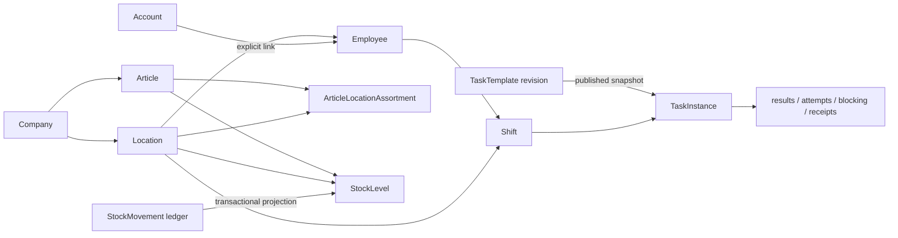

# Domain model

Reconciled 2026-10-04. The first table describes **implemented concepts** through
P1b.9 and P4.3; later sections are target concepts, not claims of existing columns,
tables or APIs. [Status](../roadmap/status.md) owns acceptance, and
[module boundaries](module-boundaries.md) owns responsibility.

## Identity and operational scope

Company is the current data/authorization boundary, independent of business name,
legal form or server identity. Location belongs to one Company. Account is a login
identity; Employee is an operational profile. Not every Account is an Employee
and a profile may exist before login. An Account–Employee link grants neither a
new role nor a new business identity automatically.

IDs remain stable across renaming, server replacement and supported exports.
Business identifiers such as SKU/personnel number are separate. A future move
between Companies is an explicit data/authorization migration, not a routine
companyId edit. Future legal entities, contracts and re-entry periods must not
rewrite the identity associated with historical work.

## Implemented model

| Concept | Owner | Actual invariant / boundary |
| --- | --- | --- |
| Company / Location | Organization | One configured Company per installation; named additional Locations supported. Current Location does not store the target IANA time zone/calendar model. |
| Account / session / link | Identity/platform | Fixed role catalog; authorized explicit Account–Employee link/revocation and current access revalidation. Company/Location/role are not inferred from profile name. |
| Employee | People | Minimal Company/Location profile with current fixed assignment scope and interval/deactivation evidence; no full temporal multi-location HR model. |
| Shift | Workforce | Employee + Location, starts before ends, draft → published → cancelled. Published employee/selections remain immutable; pristine cancellation and start/end-only amendment are supported. No general shift revision stream or delivered notifications. |
| TaskTemplate / revision | Tasks | Current templates are Location-scoped. Editable drafts, immutable published content/revision history; no current Company-wide template scope or recurrence engine. |
| TaskInstance | Tasks | One selected published revision copied into an immutable snapshot and linked to the published Shift. Assignment/source remain immutable; no independent assignee reassignment. |
| Guided Work / StepResult | Tasks | Execution belongs to TaskInstance. Ordered confirmation/numeric steps, server permission/version checks, open → in_progress → completed with blocked/resumed/cancelled paths. Guided Work is the experience, not a separate module. |
| Blocking / numeric attempt | Tasks | Original blocking and numeric attempts remain evidence; resolution is once-only. Exact numeric thousandths and fixed inclusive limits come from the snapshot. Out-of-bounds input blocks without confirming the step. |
| Command receipt | Tasks | Actor/company/resource and canonical command identity; replay returns original result after current authorization. No duplicate audit/effect. |
| Article | Inventory | Company-wide identity, bounded SKU uniqueness, optional opaque barcode, unit label and non-destructive activation. No stock or price fields owned here. |
| ArticleLocationAssortment | Inventory | Article + Location membership, with independent membership activation. Effective availability is Article-active AND membership-active, computed rather than a second state. |
| StockLevel | Stock | One level per Article/Location; current projection of ledger, version and frozen stock_unit. No supplier, valuation, batch or reservations. |
| StockMovement | Stock | Immutable opening/manual-adjustment evidence; exact target/delta/balance and movement-ID retry identity. Current kinds are opening/adjustment; no sales machine actor or automatic consumption yet. |
| AuditEntry / organization events | Platform infrastructure | Business mutation and relevant audit share the transaction. Organization emits actual outbox events; no current Workforce/Tasks events. Audit holds minimized changes, not all sensitive values. |

TaskExecution/StepResult are subordinate to the TaskInstance consistency/version
boundary, not independent aggregate completions. Confirmation results, numeric
attempts, blockings, task state and relevant audit/receipts commit together under
the supported writer discipline. Completed/cancelled tasks are terminal; a future
correction must preserve earlier evidence.

This is a concept/ownership sketch, not a database ER diagram: links describe
business relationships and not every foreign key. Shift publication and task
creation are atomic; later editing a Template cannot modify historical snapshots.
Stock quantity is never an Assortment property.

Current clients display explicit UTC shift times. Future IANA Location time zone,
recurrence and daylight-saving rules require a dedicated contract; do not claim
those properties already exist. Other named Locations do not enable distributed
execution or global employee overlap coordination.

## Future concepts and terminology

| Target concept | Intended meaning / distinction |
| --- | --- |
| Role / Capability / grant | Company role templates/definitions and user assignments; additive audited direct grants and justified scope expansion. Current roles remain fixed. |
| WikiArticle / approved revision | Versioned operational knowledge with suggestions and human approval; tasks pin what was approved/read. Not a TaskTemplate rename. |
| Fixture | Generic shelf/display/counter structure with optional zones/dimensions/slots/facings. |
| Planogram / revision / assignment | Published placement instructions referencing Articles; organizational/location rollout and feedback. Frozen instructions are separate from live Stock drill-down. |
| Recipe / revision | Optional extension of a normal Article, with ingredient Articles, units, quantities/yield and instructions. Not a second manufactured-Article identity. |
| Menu / revision | Structured sections/items and templates/print; optional Article/Recipe reference, approved price source and explicit public artifact publication. |
| Board / Chat / notification | Durable published notice vs conversation vs delivery. Separate ownership and retention/access policies. |
| ShiftSwapRequest | Proposal/recipient response/comments plus required responsible approval. Approval revalidates and atomically applies permitted schedule changes. |
| SalesSource / import / checkpoint / Sale / SaleLine / ExternalReference | Conceptual Core ingestion responsibilities for existing external POS, not final tables or StoreOS checkout. Stable external identity/provenance and explicit mapping; unresolved effects visible. |
| Production / Receiving / control execution | Their own domain evidence; Stock owns resulting physical movement, Tasks owns guided presentation. |
| EmployeeSkill / absence / actual time | Distinct from minimal profile, planned shift and task activity. No inferred attendance or unnecessary HR replication. |

A first Recipe need not wait for a full costing system; reliable cost/margin does.
A Planogram can edit/print without full Stock; live quantities consume the query
contract. Canonical sales can persist without enabled Stock effects; unit/cutover/
return/production policy precedes those effects.

HACCP owns ControlPlan, ControlExecution, Measurement, Deviation and CorrectiveAction
in a future safety domain. Today's bounded numeric task is generic evidence; no
device provenance, certified safety record or legal compliance is implied.

## Decisions still open

Future time zones/calendar rules, employment/legal-entity relationships, begun-work
reconciliation, approved Knowledge/Planogram/Menu release policies, unit conversions,
cost basis, source sales/effects and scoped remote access remain in
[risks/open questions](../risks-and-open-questions.md). Their detailed product
definitions belong in [vision](../vision.md), not speculative current schema.
