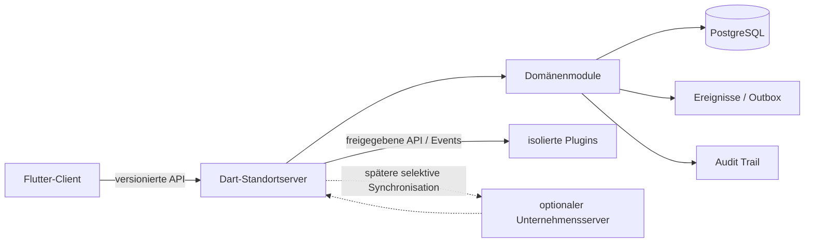

# Architekturüberblick

Status: Zielarchitektur und Grenzen für die ersten Entwicklungsphasen. Der tatsächlich implementierte Umfang ist in der [Phase-0-Grundlage](../development/phase-0.md) abgegrenzt; spätere Fähigkeiten dieses Zielbilds sind noch nicht vorhanden.

## Ausgangspunkt

StoreOS verbindet Standortbetrieb, Mitarbeiterarbeit und später weitere Geschäftsprozesse über ein gemeinsames Identitäts-, Berechtigungs-, Aufgaben-, Ereignis- und Auditmodell. Die Daten bleiben im Eigentum des Betreibers. Ein Standortserver muss die für den Standort freigegebenen Kernabläufe auch ohne Internetverbindung ausführen können. Ein Unternehmensserver ist optional und übernimmt später zentrale Stammdaten und standortübergreifende Auswertungen. Die Anwendung funktioniert ohne Cloudkonto und ohne verpflichtende Telemetrie.

Die technische Grundform ist ein modularer Monolith mit einem Dart-Backend und PostgreSQL. Ein Flutter-Client nutzt dieselben API-Verträge für Handheld, Desktop und Web, aber jeweils passende Bedienoberflächen. API und Geschäftslogik bleiben serverseitig; lokale Clientdaten dienen dem begrenzten Offlinebetrieb. [Domänenmodell](domain-model.md), [Modulgrenzen](module-boundaries.md) und die [ADR](../adr/) präzisieren diese Festlegungen.

## Schichten und Datenfluss

1. **Flutter-Client:** Zeigt Aufgaben, Schichten und Anleitungen. Er sammelt Eingaben und kann klar gekennzeichnete, erlaubte Aktionen vorübergehend lokal vormerken. Anzeige und Ausblenden sind keine Berechtigungsentscheidung.
2. **API/Application:** Authentifiziert, autorisiert, validiert Eingaben und führt einen Anwendungsfall aus. Hier liegen Transaktionsgrenze, Idempotenz, Fehlerübersetzung und Orchestrierung mehrerer Domänenports.
3. **Domain:** Erzwingt fachliche Invarianten, Zustandsübergänge und Entscheidungsregeln unabhängig von UI, HTTP und Persistenz.
4. **Infrastructure:** PostgreSQL, migrationsfähige Repositories, Outbox, lokaler Dateispeicher und externe Adapter. Plugins sehen keine internen Tabellen.

Ein erfolgreicher Befehl schreibt fachlichen Zustand, den erforderlichen Audit-Eintrag und bei Bedarf ein Ereignis innerhalb einer konsistenten lokalen Transaktion. Asynchrone Konsumenten dürfen wiederholen und müssen deshalb idempotent sein. Read-Modelle für Employee Home und Management werden aus autorisierten Quelldaten gebildet und sind nicht selbst die fachliche Wahrheit. Zwischen Standort und optionalem Unternehmensserver gibt es später pro Datentyp einen dokumentierten Eigentümer; „eine Datenbasis“ bedeutet ein gemeinsames fachliches Modell, nicht eine einzige weltweit erreichbare Datenbank.

## Erster fachlicher Vertical Slice

Nach der technischen Grundlage entsteht als erster durchgängiger Anwendungsfall:

`Company → Location → Employee → Shift → TaskTemplate → TaskInstance → Employee Home → Guided Work → Completion → Audit Log`

Für diesen Slice besitzt `organization` Unternehmen und Standort, `people` den Mitarbeiter, `workforce` die Schicht, `tasks` Vorlage, Ausführung und geführte Schritte, `audit` die auf Anwendungsebene nur ergänzbare Änderungshistorie. Plattformdienste stellen Authentifizierung, Autorisierung und API-Verträge bereit. Schichtveröffentlichung und Erzeugung der konfigurierten Aufgaben erfolgen idempotent in derselben lokalen Transaktion; [ADR 0011](../adr/0011-atomare-schichtveroeffentlichung.md) begründet diese Vereinfachung. Dabei wird die geltende Vorlagenversion als Snapshot festgehalten. Nach Commit zeigt Employee Home die eigene Schicht und eine begründete nächste Aufgabe. Der Abschluss prüft Pflichtschritte und Eingaben auf dem Server; der Audit Log hält die Änderung fest.

Der Slice umfasst noch keine automatische Personaleinsatzplanung, Zeiterfassung, vollwertige Qualifikationsverwaltung, HACCP-Zertifizierung, Unternehmenssynchronisation, POS oder Lagerwirtschaft. Ihre späteren Module dürfen die schon dokumentierten Grenzen nicht rückwirkend aufbrechen. Der [Fahrplan](../roadmap/phases.md) legt die Reihenfolge fest.

## Betrieb und Evolution

- Der Standortserver ist der Schreibort für standortgebundene operative Vorgänge. Ein optionaler Unternehmensserver erhält später nur definierte Daten und Befehle; WAN-Ausfall stoppt die lokalen freigegebenen Abläufe nicht.
- Jede API wird versioniert und serverseitig berechtigt. Identitäten, Personalstammdaten, operative Arbeit und Audit haben unterschiedliche Zugriffsgrenzen.
- Ereignisse verbinden Module und Integrationen nach erfolgreichem Commit. Sie ersetzen keine direkte Konsistenzprüfung eines fachlichen Befehls.
- Fremde Plugins laufen mit expliziten Fähigkeiten und erzwungener Prozess-/Containerisolation. Ohne diese Schutzgrenze werden sie nicht aktiviert. Ihr Ausfall darf unabhängige Kernabläufe nicht blockieren; ein tatsächlich benötigter Adapter wird als nicht verfügbar angezeigt.
- Änderungen an Datenhoheit, Offlinebefehlen und regulatorischen Prozessen erfordern eigene Entscheidung und Tests, bevor sie in den freigegebenen Kernbetrieb gelangen.

## Offene Architekturfragen

- Welche Daten schreibt später der Unternehmensserver autoritativ, und welche bleiben immer standortgeführt?
- Welche konkreten Vorgänge dürfen auf einem Handheld ohne Verbindung zum Standortserver vorgemerkt werden?
- Welche Aufbewahrungsfristen und Beleganforderungen gelten je Branche, Rechtsraum und Mandant?
- Wie werden mehrere Standorte einer Person, Dienstreisen und geteilte Geräte im ersten produktiven Mandantenmodell abgebildet?
